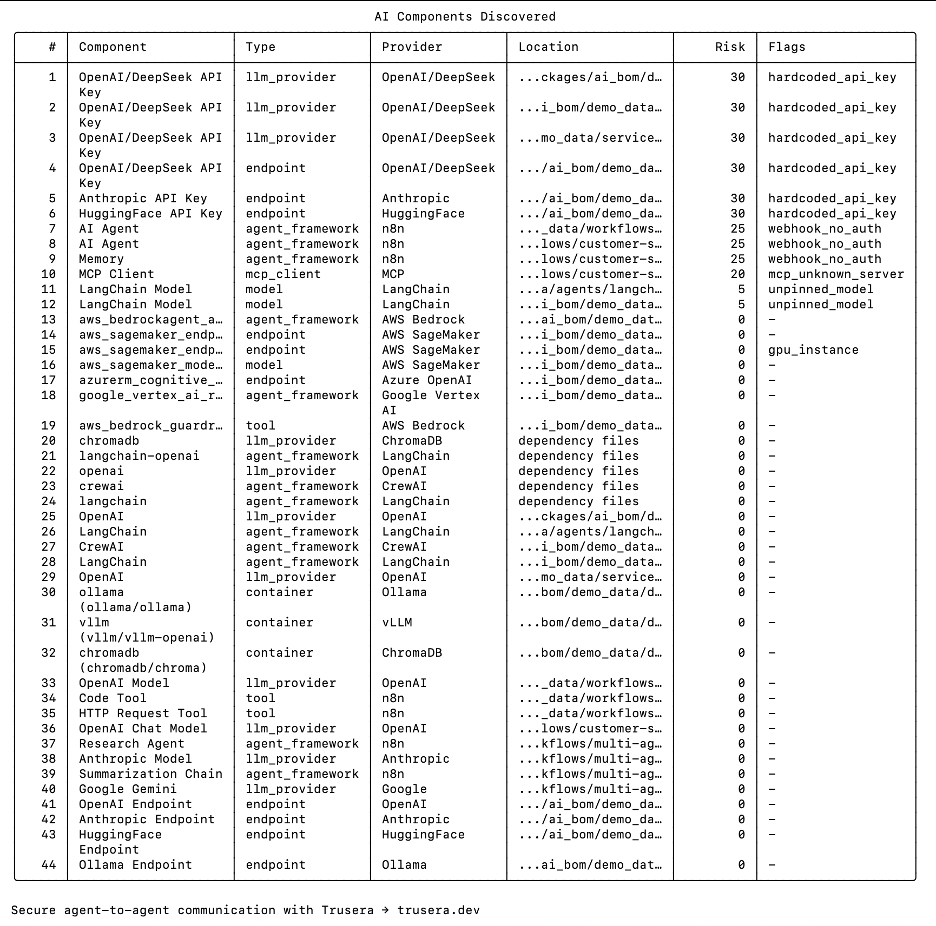

# Getting Started with AI-BOM: Generate an AI Bill of Materials

AI-BOM is an open-source CLI tool that helps teams understand where AI is used in their software.

By scanning your codebase, it creates an **AI Bill of Materials (AI-BOM)** — a machine-readable list of AI-specific components such as large-language models (LLMs), agent frameworks, prompts, API keys, and other AI building blocks.

Knowing these components helps you manage risks, licensing, and supply-chain obligations.

This tutorial walks through installation, running your first scan, understanding the output, and integrating AI-BOM into CI/CD.

---

## Table of Contents

- [What is an AI-BOM?](#what-is-an-ai-bom)
- [Installation](#installation)
- [First Scan](#first-scan)
- [Understanding the Output](#understanding-the-output)
- [CI/CD Integration](#cicd-integration)
- [Next Steps](#next-steps)

---

## What is an AI-BOM?

An AI Bill of Materials (AI-BOM) is similar to a Software Bill of Materials (SBOM), but focused specifically on AI-centric components.

AI-BOM scans your codebase and infrastructure to detect:

- **LLM providers** (OpenAI, Anthropic, Google, Ollama, etc.)
- **Models and embeddings** referenced in code
- **Agent frameworks** (LangChain, CrewAI, AutoGen, etc.)
- **Prompts and chains**
- **API keys and secrets**
- **Cloud AI services and containers**

It supports multiple output formats including JSON, YAML, SARIF, and CycloneDX.

---

## Installation

AI-BOM requires **Python ≥ 3.10**.

### Recommended: Install with pipx

```bash
pipx install ai-bom
```

> **Alternative:** Install inside a virtual environment

```bash
python3 -m venv .venv
source .venv/bin/activate
pip install ai-bom
```

Verify installation:

```bash
ai-bom --help
```

Check version:

```bash
ai-bom version
```

Full documentation:
https://github.com/Trusera/ai-bom

---

## First Scan

Navigate to your project root and run:

```bash
ai-bom scan .
```

Or try the built-in demo:

```bash
ai-bom demo
```



Within seconds, AI-BOM identifies:

- LLM providers
- Models
- Agent frameworks
- Hardcoded API keys
- Cloud AI services
- Containers
- Risk scores and flags

---

## Example JSON Output

AI-BOM can generate structured output in JSON format.

Example:

```json
{
  "components": [
    {
      "name": "openai",
      "type": "llm_provider",
      "provider": "OpenAI",
      "risk_score": 0,
      "location": "requirements.txt"
    },
    {
      "name": "OpenAI API Key",
      "type": "llm_provider",
      "provider": "OpenAI",
      "risk_score": 30,
      "flags": ["hardcoded_api_key"],
      "location": "app.py:12"
    }
  ]
}
```

---

## Understanding the Output

Each detected component includes metadata:

| Field        | Description |
|-------------|-------------|
| `name`      | Component name |
| `type`      | Category (llm_provider, model, agent_framework, etc.) |
| `confidence`| Match confidence score |
| `risk_score`| Risk rating |
| `location`  | File path and line number |
| `flags`     | Additional signals (e.g., hardcoded_api_key) |

This helps teams understand how AI is used and identify potential risks.

---

## CI/CD Integration

You can integrate AI-BOM into GitHub Actions:

### Simple CLI-based step

```yaml
- name: Run AI-BOM scan
  run: ai-bom scan . --fail-on medium
```

Useful flags:

- `--fail-on` → Fail build based on risk level
- `-f cyclonedx` → Generate CycloneDX output
- `-f sarif` → Output SARIF for GitHub Code Scanning

Integrating AI-BOM in CI ensures new AI usage is detected during pull requests.

---

## Next Steps

- Explore the repository: https://github.com/Trusera/ai-bom
- Run AI-BOM on your own projects
- Integrate into CI/CD
- Contribute new scanners or improvements

With a single command, AI-BOM gives visibility into AI usage across your codebase.

